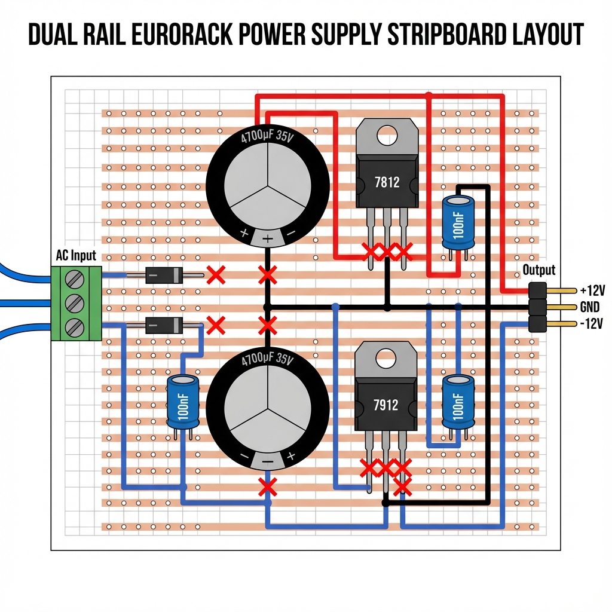

# Power Supply Build Guide

### Overview
**WARNING: POWER ELECTRONICS.** While 12V is generally safe to touch, shorts can cause fires or explode components. Double-check all polarities (especially capacitors) before powering on. 

This build uses a **Stripboard** (Veroboard) converting standard schematic logic into linear tracks. You will need to "cut" traces to break connections.

### Tools needed
*   **Soldering Iron** & Solder
*   **Multimeter** (ESSENTIAL)
*   **Track Cutter** (or a drill bit) to break stripboard tracks.
*   **Wire Strippers**
*   **Desoldering Pump** (Mistakes happen).

### Bill Of Materials
*   **1x** Stripboard (approx 20 rows x 20 columns minimum).
*   **1x** 12V AC Wall Wart (2000mA / 24VA). **MUST BE AC OUTPUT.**
*   **1x** DC Barrel Jack (Panel Mount) - 2.1mm / 2.5mm "Universal" fit recommended.
*   **1x** SPST Switch (Panel Mount). *Note: Illuminated Rocker Switch (12V) is a great alternative.*
*   **Power Components**:
    *   **1x** L7812CV (+12V Regulator, TO-220).
    *   **1x** L7912CV (-12V Regulator, TO-220). *Note: Different pinout to 7812!*
    *   **2x** 2200uF 25V Electrolytic Capacitors.
    *   **2x** 10uF 25V Electrolytic Capacitors (Decoupling).
    *   **2x** 1N4004 Diodes (Rectifiers).
*   **Indicators**:
    *   **2x** 5mm LEDs (Green/Red - Diffused recommended).
    *   **2x** 1k Resistors (Current limiting for LEDs).
*   **Connection**:
    *   1x **16-pin Male Boxed/Shrouded Header**. This provides the 10-pin power connection plus 5V and Gate/CV bus access for expansions. **Key for reverse-polarity protection.**
    *   Pin headers or terminal blocks for wiring panel components.

### Schematic / Wiring Diagram
**Logic**:
1.  **AC Input** enters via Jack -> One leg goes to Switch -> Circuit.
2.  **Rectification**: Two diodes split the AC wave. 
    *   D1 (Forward) creates positive raw voltage.
    *   D2 (Reverse) creates negative raw voltage.
3.  **Filtering**: Large caps (2200uF) smooth the raw pulses into DC ripple.
4.  **Regulation**: 
    *   L7812 keeps positive rail at exactly +12V.
    *   L7912 keeps negative rail at exactly -12V.

**Circuit Diagram**:
```
                          ┌────────────────┐
   [AC JACK]──►[SWITCH]───┤                │
                          │    D1 (1N4004) ├──►[C1 2200uF]──►┌─────────┐
                          │        │       │                 │  L7812  ├──► +12V
                          │       ─┴─      │                 │ IN  OUT │
             ┌────────────┤                │                 └────┬────┘
             │            │    D2 (1N4004) ├──►[C2 2200uF]──►┌────┴────┐
             │            │        │       │   (reversed)    │  L7912  ├──► -12V
             │            │       ─▼─      │                 │ IN  OUT │
             │            └────────────────┘                 └────┬────┘
             │                                                    │
            GND ◄─────────────────────────────────────────────────┘
                                  (Common Ground)
```

**Stripboard Layout**:

*Follow this layout carefully. Ensure cuts under the ICs are clean and complete.*

### Step By Step guide

#### Phase 1: Breadboard Prototyping
**CRITICAL**: Build this on a breadboard first to verify your Wall Wart is actually AC and your regulators work.
1.  Connect Wall Wart to Jack. Measure output of Jack with Multimeter (AC Volts). Should be ~12-14V AC.
2.  Build just the Positive side: Diode -> Capacitor -> Input of 7812.
3.  Measure 7812 Output. Should be steady +12V DC.
4.  Build the Negative side: Reversed Diode -> Capacitor (Reversed!) -> Input of 7912.
5.  Measure 7912 Output. Should be steady -12V DC.

#### Phase 2: Stripboard Assembly
1.  **Prepare Board**: Cut the board to size.
2.  **Cut Tracks**: Use the track cutter to break strips under the ICs (Regulators) so input/output/ground don't short.
3.  **Links**: Solder jumper wires FIRST (e.g., connecting Grounds).
4.  **Components**: Solder minimal height parts first (Diodes, Resistors) -> then Headers -> then Capacitors -> then Regulators.
5.  **Heatsinks**: Bolt heatsinks to regulators if using them. Ensure they don't touch each other!

#### Phase 3: Panel Wiring
1.  Mount Jack, Switch, and LEDs to 3D printed faceplate.
2.  Wire Jack -> Switch -> Stripboard AC Input.
3.  Wire Stripboard +12V/-12V/GND -> LEDs (via resistors).

### Troubleshooting
*   **Hum/Buzz**: Capacitor values too low or bad solder joint on filter caps.
*   **Regulator Hot instantly**: SHORT CIRCUIT. Unplug immediately. Check track cuts.
*   **Output is 0V**: Check fuse (if installed) or Switch wiring.
*   **Negative Rail is Positive**: Capacitor polarity reversed or Diode backward.

### Testing plan (Enhanced Safety)
1.  **Visual Inspection**: 
    *   Check all polarized capacitors. **If backwards, they will explode.**
    *   Check Diode orientation (Stripes must match layout).
    *   Check IC orientation (L7812 vs L7912 are NOT interchangeable).
    *   **Track Inspection**: Hold the board up to a light. Ensure no copper debris is bridging tracks, especially where you made cuts.
2.  **Continuity Check (Power OFF)**: 
    *   Set Multimeter to "Beep" or "Ohms".
    *   Check **Input AC to GND**: Should be Open (No beep).
    *   Check **+12V Output to GND**: Should show charging capacitor (brief beep then silence/climbing resistance). If steady ZERO ohms, you have a short.
    *   Check **-12V Output to GND**: Same as above.
    *   Check **+12V to -12V**: Should be Open.
3.  **Voltage Check (No Load)**: 
    *   Power on the AC Wall Wart (Switch OFF first).
    *   Flip Switch ON. LEDs should light up.
    *   **Measure +12V Rail**: Red Probe on +12, Black on GND. Target: **+11.8V to +12.2V**.
    *   **Measure -12V Rail**: Red Probe on -12, Black on GND. Target: **-11.8V to -12.2V**.
    *   *If voltages are wrong (e.g. 18V or 0V), Turn OFF immediately.*
4.  **Load Test (The "Smoke Test")**: 
    *   Connect a 1k resistor between +12V and GND. Verify voltage stays stable.
    *   Connect a 1k resistor between -12V and GND. Verify voltage stays stable.
    *   Only if stable, connect a real module (e.g. Passive Attenuator or cheap test utility).
